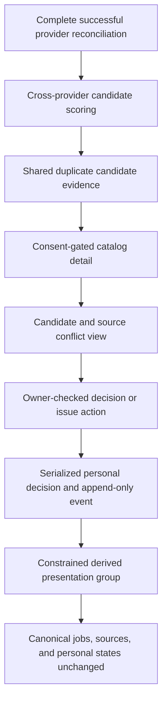

# Catalog Duplicate Control - Plan

## Goal Capsule

Deliver the automatic-catalog duplicate workflow: detect only cross-provider similarity, let each signed-in user merge, keep separate, or undo that presentation choice, and retain every canonical job, source link, attribution, and personal state.

The automatic catalog remains factual and shared. A merge is a user-specific view, never a mutation or deletion of `canonical_jobs`, `source_postings`, or `personal_job_states`.

Stop if the current data model cannot preserve source provenance, owner isolation, and reversible history atomically.

---

## Product Contract

### Summary

This plan adds explainable, cross-provider duplicate suggestions to the existing automatic catalog and gives each user a reversible personal grouping decision. It also makes all conflicting source facts and attributions visible in the detail journey.

### Problem Frame

The catalog can contain two listings for one hiring opportunity when separate providers publish it. Treating them as identical automatically risks hiding a real distinction or losing an applicant's saved state and source context.

### Requirements

**Candidate generation**

- R1. The system creates an explainable candidate only for two distinct canonical jobs supported by different providers and never treats a score as an automatic merge. Covers FR-006, DT-007.
- R2. Candidate identity is an ordered canonical-job pair, is idempotent across collection retries, records the latest complete reconciliation generation of both provider endpoints, and becomes unavailable for new suggestions only when that factual basis is no longer eligible. Covers FR-006, DT-007.

**Personal decisions and recovery**

- R3. A signed-in user can mark a candidate as merged, keep it separate, or undo that decision without changing shared catalog facts, source postings, or either canonical job's personal state. A separate decision is a hard pair constraint; a merge that would reconnect a separate pair and a separate request whose endpoints are already indirectly connected are rejected with no write and explicit recovery guidance. Covers FR-007, UR-003, UR-004.
- R4. Each user can access and change only their own decision and issue-report records. Decision history is append-only, mutation retries are idempotent through an operation fingerprint, and stale updates cannot overwrite a later choice. Covers FR-012, DT-007, UR-007.

**Trustworthy detail and feedback**

- R5. Candidate and merged detail views show the counterpart, all original provider attributions and links, and field-level conflicting values with their source and observation time. Covers FR-010, FR-021, DT-002, DT-003.
- R6. A user can report an incorrect value, duplicate, broken link, attribution problem, or other source problem with bounded text and truthful success or retry feedback. Covers UR-005, UR-007.

**Experience and safety**

- R7. Merge, separate, undo, and issue-report controls are keyboard-operable, expose a clear pending/success/error state, keep their original touch-target standards, and preserve the existing automatic-detail and legacy-manual paths. Covers FR-004, FR-011, FR-016.
- R8. No browser path can create or alter shared candidates, raw source values, provider configuration, or another user's personal decision, report, state, or audit history. Every personal mutation rechecks latest consent, target visibility, candidate eligibility, and database-enforced rate limits in the same transaction. Covers FR-019, FR-020, DT-004.
- R9. Personal duplicate decisions carry portable endpoint identities for future backup/restore without treating candidate or canonical UUIDs as cross-environment identity. Covers FR-018, UR-006.

### Acceptance Examples

- AE1. Given two active canonical jobs from different providers that meet the similarity rule, when a collector succeeds, then the user sees a candidate but both catalog rows remain independently factual.
- AE2. Given a user merges candidates A-B and B-C, when they undo only A-B, then B-C remains merged and every source link and saved state remains available.
- AE3. Given A-B is explicitly separate, when a requested merge would connect A to B indirectly, then it is rejected with guidance instead of changing an existing decision.
- AE4. Given two sources disagree on deadline or location, when the user opens a merged candidate, then the page presents both values with provider and observed time instead of selecting an unproven winner.
- AE5. Given a rejected mutation or report, when the user retries, then the UI does not claim success until the authenticated database change completes.

### Scope Boundaries

- This plan does not auto-merge, delete, or rewrite cross-provider catalog rows.
- This plan does not change legacy `jobs`, `duplicate_pairs`, or `duplicate_groups`; those remain the manual/legacy path.
- This plan does not activate an unapproved provider, scrape a provider, or submit an application on a user's behalf.

#### Deferred to Follow-Up Work

- Backup v2 includes the resulting personal duplicate decisions after US5's portable source-reference work is complete.
- Operator review workflows for submitted source reports are part of the operations story, not this personal reporting flow.

---

## Planning Contract

### Key Technical Decisions

- KTD1. **Model merge as a constrained personal graph of confirmed candidate edges.** A separate edge is a hard negative constraint. User-level serialization rejects any merge that would reconnect its endpoints indirectly, and rejects a requested separation with no write if its endpoints are already connected through other confirmed edges. Components are capped at 25 members: mutation, detail, and feed fail closed with a typed no-write/no-partial-result error at that limit. A representative is derived deterministically per connected component, not trusted from an edge preference. This preserves R3 without a shared canonical merge.
- KTD2. **Keep candidate facts, evidence revisions, and personal choices separate.** `duplicate_candidates` stores the ordered pair plus concrete cross-provider source evidence and its revision. Owner-scoped decisions and append-only events hold personal intent. This implements R1, R2, R4, and R9 without mixing catalog data and personal state.
- KTD3. **Use hardened, owner-checked mutation RPCs for atomic personal changes.** A private per-user graph-lock row is created idempotently and locked before every traversal; the candidate row is then locked. Fixed search paths, explicit caller/latest-consent/visibility checks, database-enforced per-owner quotas, an operation ID plus immutable action/payload fingerprint, and an expected revision make decision/event writes replay-safe. Exact replays return the stored result; reusing an ID with different input fails. Browser roles have no direct candidate, decision-event, or report DML. This governs R3, R4, and R8.
- KTD4. **Add an additive companion duplicate-detail projection.** A distinct strict RPC preserves the stable existing catalog-detail response while returning only bounded candidate, group, attribution, conflict, and current-user data. Source links must be absolute HTTPS URLs without credentials and on an allowed provider host; rendered external links use `noopener noreferrer`. It never exposes raw provider payloads or operational secrets. This governs R5 and R8.
- KTD5. **Refresh candidate evidence inside complete reconciliation finalization.** Before a provider run is marked succeeded, the same database transaction validates the current canonical/source relationship, pair order, provider distinction, score, and reason codes, records both endpoint providers' latest complete generations, and idempotently upserts evidence. A pair is active only while both endpoint generations are complete and current. Partial or failed runs, or a refresh failure, leave the prior candidate revision unchanged and the run retryable. This governs R1 and R2.
- KTD6. **Project a personal group in the feed without combining member facts.** A group is included when any member matches a query or saved-only filter, is hidden only when all members are excluded, and uses the highest matching member under the existing catalog sort as its temporary card representative. This governs R3 and R7.

### High-Level Technical Design

### Assumptions

- Candidate scoring can use only normalized catalog fields and allowed source provenance already available to the collector.
- The client creates one operation ID for an action and retains it until it receives a terminal result; the server action sends its action, candidate/pair, expected revision, and bounded payload fingerprint with that ID.
- Inactive candidates remain historically addressable to preserve personal decision history but are not newly offered in the automatic detail UI.

### System-Wide Impact

- The collector gains a complete-run candidate-refresh boundary without enabling Saramin or any other unapproved provider.
- An additive duplicate-detail RPC and strict Zod schema become the sole automatic-detail data path for candidate, attribution, conflict, and current-user decision information.
- The personal feed gains a group projection while retaining member-specific filtering, personal status, and catalog identity.
- Personal decisions store portable source references now; the full backup v2 export/import behavior remains in its follow-up work.

### Risks and Dependencies

- Overlapping candidate edges can defeat a user separation choice. A private per-user graph lock, negative-edge validation, and the shared 25-member fail-closed traversal limit mitigate this risk.
- Candidate evidence can become stale during partial collection. Only complete reconciliation supersedes evidence; detail rechecks candidate evidence against current provider and source eligibility.
- Shared-detail expansion can leak `source_values`, an arbitrary reason, or another user's private history. SQL allowlists, strict recursive schemas, fixed response shapes, and per-user joins mitigate this risk.
- The migration must not use cascade paths from candidate activity to canonical, source, or personal-state records. Candidate hard delete stays unavailable; only account deletion cascades private rows.
- Local Supabase must be available for migration, RLS, and pgTAP validation. A rollback disables the feature flag or new RPC grants while retaining decision evidence for recovery; it never performs a destructive down migration.
- The E2E scenario harness needs mutable, context-scoped fixture state. It is enabled only by the explicit local test flag and remains unavailable in Preview and Production.

### Sources and Research

- `specs/004-automatic-job-discovery/spec.md` defines FR-006/007/021, DT-002/003/007, UR-003/004/005, and the user-story acceptance cases.
- `specs/004-automatic-job-discovery/data-model.md` defines candidate ordered-pair identity and personal decision records.
- `specs/004-automatic-job-discovery/research.md` Decision 2 and Decision 7 require an additive catalog model and candidate-only automation.
- [Supabase Row Level Security](https://supabase.com/docs/guides/database/postgres/row-level-security) and [database-function security guidance](https://supabase.com/docs/guides/database/functions?example-view=sql&language=sql&queryGroups=example-view&queryGroups=language) inform the owner-isolation and hardened-RPC boundary.

---

## Implementation Units

### U1. Candidate domain contract and scoring

- **Goal:** Define deterministic, explainable cross-provider candidate scoring and ordered-pair identity without any grouping side effect.
- **Requirements:** R1, R2, AE1.
- **Dependencies:** None.
- **Files:** `lib/domain/catalog-duplicates.ts`, `tests/unit/catalog-duplicates.test.ts`, `lib/validation/feed.ts`.
- **Approach:** Create a separate catalog domain module. Normalize only permitted catalog fields, require distinct provider evidence, emit stable reasons and a bounded score, and reject self, same-provider, weak, and reverse-duplicate pairs.
- **Execution note:** Implement the scoring contract test-first so score thresholds and explanation fields stay intentional.
- **Patterns to follow:** `lib/domain/duplicates.ts` for explainable scoring only; do not import its legacy storage semantics.
- **Test scenarios:**
  - A strong cross-provider company/title/role/location/date match creates one ordered candidate with stable reasons.
  - Reversing the input jobs produces the same ordered identity and explanation.
  - Self pairs, same-provider evidence, weak matches, and malformed dates never qualify.
  - Score and reasons remain bounded and safe for strict client parsing.
- **Verification:** Focused catalog-duplicate unit tests pass and legacy duplicate tests remain unchanged.

### U2. Shared candidate, constrained personal graph, and issue-report persistence

- **Goal:** Add additive catalog-duplicate tables, permissions, owner policies, decision history, and mutation/query functions.
- **Requirements:** R1, R2, R3, R4, R6, R8, R9, AE2, AE3, AE5.
- **Dependencies:** U1.
- **Files:** `supabase/migrations/20260808000500_duplicate_decisions.sql`, `supabase/tests/catalog_duplicate_decisions.test.sql`, `lib/supabase/database.types.ts`.
- **Approach:** Add ordered cross-provider candidate evidence with source-posting identities, complete provider generations, and evidence revision; owner-only effective decisions; immutable decision events; and owner-only issue reports. Enforce `left < right`, distinct canonical IDs, unique pairs, and no candidate hard delete. Create and lock a private per-user graph row before locking the candidate and traversing the graph. Reject with no decision/event write when a merge violates an explicit separate pair or a requested separation is already indirectly connected; return the exact blocking confirmed edges for recovery. Derive component representatives deterministically, enforce the 25-member limit before writing, and append the decision event in the same transaction. Store stable operation IDs, expected/effective revisions, before/after state, action/payload fingerprints, and portable endpoint references. Every decision, undo, and report RPC validates latest consent, target visibility, current eligibility, source membership, and transactional per-owner quotas before any write. Preserve every existing canonical, source, and personal state row.
- **Execution note:** Start with pgTAP contracts for RLS, grants, ordered-pair uniqueness, event history, pair-scoped undo, and state preservation before migration implementation.
- **Patterns to follow:** `supabase/migrations/20260808000400_personal_job_states.sql` for grants/RLS and strict catalog RPC conventions; `docs/engineering/lessons-learned.md` for safe JSON handling.
- **Test scenarios:**
  - A service context can create/update one valid ordered candidate with two distinct provider source-posting references while browser roles cannot alter it.
  - Reversed or concurrent pair creation produces one candidate; self, same-provider, inactive, malformed-reason, and out-of-range-score candidates fail.
  - Two users cannot read or change each other's decisions, history, or reports.
  - Merge, separate, and undo append one event for one operation ID; a duplicate retry returns the prior result and a stale revision cannot overwrite a later decision.
  - A separate A-B blocks any requested merge that would reconnect A and B through another edge; a requested separation whose endpoints are already indirectly connected writes nothing and returns the exact merge edges that must be undone, while undoing one permitted edge preserves unrelated confirmed edges.
  - Edge insertion order, reverse-pair retry, and concurrent requests derive the same component representative.
  - Invalid candidate IDs, representative IDs outside the pair, oversized reports, direct audit writes, user/status/timestamp spoofing, consent revocation, superseded candidates, and direct-RPC quota abuse fail without a partial change or target enumeration.
  - A component at the 25-member limit rejects a further merge without a partial event, decision, or truncated group result.
  - A decision, undo, candidate supersede, or failed mutation leaves canonical, source-posting, and personal-state primary keys and content unchanged.
  - An issue report persists only its bounded, idempotent user input and verified target references; account deletion removes only that account's private records.
- **Verification:** Focused pgTAP proves the DB constraints, graph conflict behavior, operation replay, transaction rollback, RLS, grants, quotas, no-loss digest, portable endpoint projection, and fail-closed component limit; the complete local database suite and lint pass; generated TypeScript types match the new RPC/table shapes.

### U3. Collection refresh and safe automatic-detail projection

- **Goal:** Refresh candidates after complete ingest and expose safe candidate/group/conflict detail data through a versioned authenticated companion contract.
- **Requirements:** R1, R2, R5, R8, AE1, AE4.
- **Dependencies:** U1, U2.
- **Files:** `lib/collection/collect.ts`, `supabase/migrations/20260808000500_duplicate_decisions.sql`, `lib/validation/feed.ts`, `lib/supabase/database.types.ts`, `app/(dashboard)/jobs/queries.ts`, `app/(dashboard)/jobs/[id]/page.tsx`, `tests/unit/catalog-duplicates.test.ts`, `supabase/tests/catalog_duplicate_decisions.test.sql`.
- **Approach:** Perform candidate refresh inside the same database finalization transaction that records a provider's complete reconciliation as succeeded; a refresh error rolls back that finalization. Validate candidate evidence from current canonical/source relationships rather than trusting client or adapter payloads, and record both endpoint providers' current complete generations. Add an additive authenticated duplicate-detail projection and combine it with current catalog detail. Enforce the 25-member component limit without partial detail/feed output, filter inactive suggestions, retain existing owner history for undo, and recheck consent, provider, source, and evidence eligibility at read time. Emit only absolute credential-free HTTPS source URLs on verified provider hosts; render them as safe external links.
- **Patterns to follow:** `get_catalog_job_detail` and `catalogJobDetailSchema` for strict detail contracts; `ProviderAttribution` for per-source presentation requirements.
- **Test scenarios:**
  - A complete successful cross-provider reconciliation upserts one candidate with both endpoint generations, and a retry does not create another.
  - Partial, failed, same-provider, or stale/withdrawn ingest does not create or mass-supersede candidates; refresh failure rolls back finalization and leaves the run retryable.
  - A later complete refresh supersedes only evidence whose factual basis changed and preserves owner decision/event history.
  - Detail payload exposes every original source link and conflicting deadline/location with provider and observed time.
  - User A and B receive identical factual detail but only their own decision, history, and report data.
  - Payload rejects raw source values, provider configuration, secrets, arbitrary error text, unbounded arrays, non-HTTPS/encoded schemes, credentials, unverified hosts, invalid URLs, and extra fields; rendered source links cannot retain an opener.
  - Missing latest consent or stale/ineligible facts returns no new automatic candidate suggestion.
- **Verification:** Collector/detail unit tests and pgTAP prove complete-run lifecycle, source-evidence validation, bounded strict projection, and owner-isolated companion RPC access.

### U4. Catalog-specific user actions and accessible duplicate controls

- **Goal:** Add truthful user actions for merge, separate, undo, and source issue reporting, then render the candidate and conflict experience in the automatic detail page.
- **Requirements:** R3, R4, R5, R6, R7, R8, AE2, AE3, AE4.
- **Dependencies:** U2, U3.
- **Files:** `app/(dashboard)/jobs/duplicate-actions.ts`, `components/duplicate-panel.tsx`, `components/job-detail.tsx`, `components/provider-attribution.tsx`, `app/(dashboard)/jobs/[id]/page.tsx`, `app/globals.css`, `tests/unit/catalog-duplicates.test.ts`.
- **Approach:** Keep automatic actions, validators, types, and panel names separate from the legacy duplicate path. Bind authenticated Server Actions to current-user RPC results, validate FormData before mutation, and enforce distinct decision/report rate-limit buckets in the mutation RPC itself. Revalidate only RPC-confirmed canonical paths and the feed. Render the exact blocking merge edge(s), their affected job links, and a confirmation-based undo path before asking the user to retry a blocked decision; never write the blocked request. Render candidate reasons, counterpart links, effective decision/history, field conflicts, provider attribution, source issue form, and accessible feedback without collapsing source evidence.

  | Candidate state | Visible status and actions | Recovery behavior |
  |---|---|---|
  | Undecided active candidate | Explain reasons; enable **Merge** and **Keep separate**; no undo control. | Successful action refreshes detail and feed. |
  | Merged | State label **Merged**; enable **Keep separate** and **Undo last decision**; disable repeat merge. | Direct keep-separate replaces only this edge; undo affects only this edge. |
  | Separate | State label **Kept separate**; enable **Merge** and **Undo last decision**; disable repeat separate. | A conflicting merge returns the blocking pair and writes nothing. |
  | Indirect conflict | Explain that the requested action was not applied; show each blocking merge as a linked, confirmation-required undo action. | After a confirmed blocker undo succeeds, return to the requested pair; the user explicitly retries the original decision. |
  | Inactive candidate | Explain that the factual suggestion is no longer active; show safe historical decision context but no new merge/separate/report mutation. | Do not present it as a new suggestion or silently alter history. |
- **Patterns to follow:** `app/(dashboard)/jobs/personal-actions.ts` and `components/personal-job-controls.tsx` for action-state feedback, ownership, and 44-pixel controls; `ProviderAttribution` for required labels and original links.
- **Test scenarios:**
  - Merge, keep-separate, and undo update only the current user's presentation and report success through an accessible live region.
  - An indirect group conflict explains that an existing merge must be undone before a requested separation can take effect.
  - Invalid input, unauthenticated requests, rate-limit denial/unavailability, stale decision, and database failure show typed retry-safe feedback without a false success.
  - The detail page displays every group member, original link, provider label, conflict value, and observed time.
  - The candidate panel has a deterministic state model: repeat actions are unavailable, indirect conflicts name their exact undoable blockers, and a blocked action never reports success.
  - Controls have unique accessible names, keyboard operation, visible focus, and minimum touch targets.
  - Legacy manual detail and current personal controls remain available without automatic-catalog behavior bleeding into them.
- **Verification:** Focused unit/action tests prove catalog and legacy IDs cannot cross routes; browser accessibility checks cover automatic and legacy detail paths.

### U5. Personal feed group projection

- **Goal:** Make an effective personal duplicate group visible in the catalog list without merging or discarding member facts.
- **Requirements:** R3, R5, R7, AE2, AE3.
- **Dependencies:** U2, U3.
- **Files:** `supabase/migrations/20260808000500_duplicate_decisions.sql`, `app/(dashboard)/jobs/queries.ts`, `components/job-list.tsx`, `components/job-card.tsx`, `app/(dashboard)/jobs/page.tsx`, `lib/validation/feed.ts`, `tests/unit/catalog-duplicates.test.ts`.
- **Approach:** Extend the user feed projection after normal catalog filtering. Evaluate query criteria and saved/excluded state per member, preserve per-member badges, and choose the current user preference only when it is a matching member. Otherwise select the best matching member under the existing public sort. A grouped card links its representative title to that member's detail, exposes an accessible member-count expander, and lists each member's detail link, original source link, personal badges, and why it matched the active query/filter. The compact layout keeps this same disclosure reachable by keyboard. Do not alter the common catalog ordering or global feed for users without a confirmed group.
- **Patterns to follow:** `get_catalog_feed` and the personal-state overlay in `20260808000400_personal_job_states.sql` for candidate-before-count/limit semantics.
- **Test scenarios:**
  - A confirmed group appears as one personal presentation item while every member remains queryable and linkable.
  - A group appears when any member matches query/filter or saved-only, and hides only when all members are excluded.
  - Component order and temporary representative are stable across reload, reverse input, and user preference mismatch.
  - Separate and undo return the same members to independent list cards without changing their personal state.
  - Unconfirmed, inactive, and another user's decisions do not alter the current user's list.
- **Verification:** Feed-query unit and pgTAP regression tests prove no change to global ordering, counts, filters, or unrelated users.

### U6. Deterministic end-to-end scenarios and regression gate

- **Goal:** Prove the complete duplicate journey in a mutable non-production scenario without using an external provider or mutating production state.
- **Requirements:** R1 through R9, AE1 through AE5.
- **Dependencies:** U1, U2, U3, U4, U5.
- **Files:** `lib/e2e/automatic-discovery.ts`, `lib/e2e/discovery-feed.ts`, `app/api/e2e/automatic-discovery/route.ts`, `tests/e2e/duplicates.spec.ts`, `tests/e2e/provider-attribution.spec.ts`.
- **Approach:** Extend the cookie-gated E2E scenario with two source-backed canonical jobs, conflicting values, mutable user decision/report state, and saved/memo/status overlays. Keep the bypass unavailable in production and preserve independent browser-context cookies.
- **Patterns to follow:** `tests/e2e/application-tracking.spec.ts` and `docs/engineering/lessons-learned.md` for context-scoped setup and post-action refresh behavior.
- **Test scenarios:**
  - Candidate appearance never auto-groups records before a user acts.
  - Merge, separate, undo, and a blocked indirect-separation conflict preserve every source link and personal state across a reload.
  - Conflicts, source attribution, and observed time remain visible in the grouped detail.
  - A report succeeds idempotently and an injected failure remains editable with clear retry feedback.
  - Different E2E users cannot observe one another's decisions or reports.
  - Local test mode accepts the fixture route only when `E2E_BYPASS_AUTH=true`; local mode without that flag, Preview, and Production reject the route and forged fixture cookies.
- **Verification:** Focused Chromium duplicate and attribution suites pass with no external browser network calls; local disabled-mode, preview-mode, production-mode runtime, and deployed smoke checks return no fixture cookie or bypass response.

---

## Verification Contract

| Scope | Evidence | Done signal |
|---|---|---|
| U1, U3, U4, U5 | `npm run test:unit -- tests/unit/catalog-duplicates.test.ts` | Candidate scoring, strict safe detail parsing, action contracts, and personal feed grouping pass. |
| U2, U3, U5 | `npx supabase test db supabase/tests/catalog_duplicate_decisions.test.sql` | Candidate evidence, RLS, constrained graph, replay safety, rollback, portable references, and provenance contracts pass. |
| U6 | `npx playwright test tests/e2e/duplicates.spec.ts tests/e2e/provider-attribution.spec.ts --project=chromium` | User-controlled duplicate journey, attribution, feedback, feed grouping, and production gate pass. |
| Database regression | `npx supabase test db` and `npx supabase db lint --local` | Existing catalog, personal-state, ingest, and backup contracts remain valid. |
| Application regression | `npm run verify` and `npm run test:e2e` | Lint, typecheck, unit, build, and end-to-end regressions pass. |
| Release sequence | Apply additive migration with the duplicate feature flag disabled; verify production RPC signatures, grants, and a consent-gated read-only smoke query; then enable the application surface. | A flag rollback disables reachability without a destructive down migration or loss of decision evidence. |

---

## Definition of Done

- U1 through U6 meet their stated verification outcomes.
- A cross-provider similarity creates a candidate only; no automatic catalog merge exists.
- A per-user constrained merge graph supports separate and pair-scoped undo without allowing an indirect reconnection that violates a separation decision.
- The graph-lock row serializes every user graph mutation, and the 25-member component limit fails closed without committing a partial decision or displaying a partial group.
- Merge, separate, undo, refresh, and failure paths cause zero loss or mutation of canonical rows, source links, attribution, or personal states; decision history remains replay-safe and private.
- Candidate evidence has a provable cross-provider source basis, records two current complete provider generations, remains active only while its current factual basis is eligible, and stores portable endpoint identities for the backup-v2 contract.
- Automatic detail presents safe, provenance-backed conflict data for every group member and never exposes raw provider payload, secrets, or unsafe source URLs.
- The personal feed groups only the current user's confirmed members while retaining member-level filtering, exclusion, saved state, sort determinism, and links.
- Database permissions and transactional checks prove browser roles cannot alter shared candidate evidence, audit events, another user's records, bypass mutation quotas, or mutate after consent/eligibility changes.
- Legacy manual duplicate behavior, personal application tracking, and automatic catalog behavior pass their regression suites.
- No abandoned fixture, bypass, experiment, or duplicate legacy implementation remains in the final diff.
