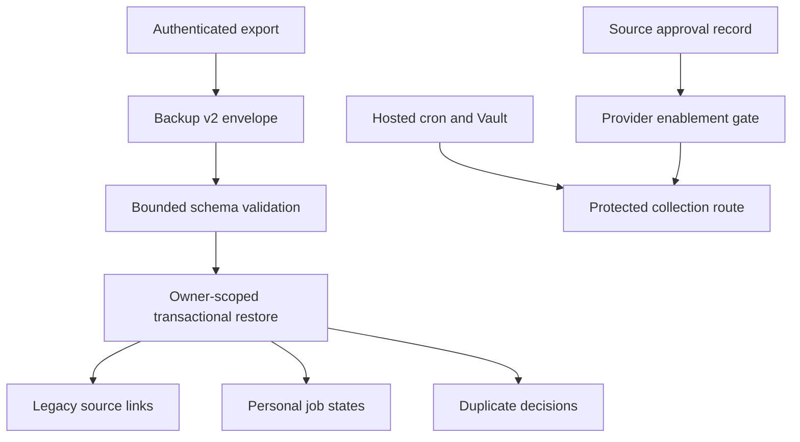

# Launch Readiness Foundation - Plan

## Goal Capsule

Complete the code-controlled launch foundations for the job-discovery service: portable backup v2, manual-to-catalog identity links, a hosted-only collection schedule, and auditable source-approval operations.
The work must preserve the existing v1 backup and manual-job workflows.
It must not enable a real provider, make a live provider request, or claim public-launch readiness without written source approval and production evidence.

---

## Product Contract

### Summary

The product already has an authenticated catalog, personal tracking, collection safeguards, and a deployed UI.
It cannot yet satisfy the public-service bar because restore portability, hosted collection activation, and two approved real sources are incomplete.
This plan builds the first two safely and records the evidence required for the third.

### Problem Frame

Users need their saved state, duplicate decisions, and links to survive a cross-device or disaster-recovery restore.
Operators need a safe, reversible collection schedule and a record of each source's legal approval before automatic collection becomes visible to users.

### Requirements

**Portable personal data**

- R1. Keep `schemaVersion: 1` export validation and import behavior compatible.
- R2. Add a bounded version-2 backup envelope with closed JSON Schema and Zod contracts that carries manual-to-catalog links, sparse personal states, and portable catalog duplicate decisions without exposing secrets or raw provider payloads.
- R3. Restore version-2 data atomically and idempotently for the authenticated owner, including an owner-scoped unresolved overlay when a referenced catalog identity or duplicate candidate is absent.
- R4. Preserve each model's existing status, memo, save/exclude state, and manually registered jobs across link, unlink, export, and restore; the v1 legacy payload keeps legacy statuses while v2 catalog states use the current catalog-state enum.

**Hosted collection safety**

- R5. Define a production-only schedule that calls the existing collection endpoint hourly, lets the six-hour provider due check decide whether work is due, and never schedules local, test, preview, or staging databases.
- R6. Require protected URL and secret material from Supabase Vault before scheduling; document disable and rollback before activation.

**Source and release evidence**

- R7. Record source approval references, terms, retention, quota, attribution, and operator evidence without recording access keys.
- R8. Keep unapproved sources disabled and registry-excluded through a server-enforced provider activation record; the first real-provider activation requires approved credentials, a successful staging smoke run, and an explicit operator enablement action.

### Scope Boundaries

**In scope**

- The deferred automatic-discovery US5 legacy-link and backup-v2 foundations.
- A migration and runbook for hosted scheduling that remains inactive until Vault and production configuration are supplied.
- A durable, secret-free source-approval record and launch-checklist evidence links.

**Deferred to follow-up work**

- Saramin registration in the live collector until the approved key, permitted retention conditions, and staging evidence are available.
- A second real connector such as Work24 until written API permission exists.
- Production enablement, a 100-active-job proof, freshness measurement, rollback drill, and representative user trial.

---

## Planning Contract

### Key Technical Decisions

- KTD1. **Use portable source identities, not catalog UUIDs, in backup v2.** A restore resolves `(provider, externalId, originalUrl)` against the target catalog. An unresolved source state or duplicate pair is stored in an owner-scoped overlay with its safe display snapshot and reconciles only after a matching catalog identity later exists. It never creates a shared catalog fact from user data.
- KTD2. **Keep restore in an authenticated transactional RPC.** The RPC rejects a missing `auth.uid()`, derives the owner only from that caller, validates the complete parsed envelope, upserts idempotently, and rolls back all changes on any error. Private tables use FORCE RLS with owner policies and no direct browser writes.
- KTD3. **Treat legacy links as additive personal references.** Link and unlink actions never merge, delete, or alter `canonical_jobs`, `source_postings`, or another user's personal data. (session-settled: user-directed — chosen over collapsing shared catalog rows: users must retain original sources and personal state.)
- KTD4. **Create a production schedule only through a strict enable operation.** The migration exposes a service-role-only enable/disable function but creates no job. Local, test, preview, and staging environments always succeed without a schedule. The production enable operation uses a provisioned production marker and an exact allowlisted `APP_BASE_URL`, verifies a Vault URL is HTTPS without credentials or fragments and has the fixed collector path, then atomically replaces the named job. The cron command stores only a secret-free helper call; that helper reads Vault and creates the authorization header. Any failure leaves no job. Staging proves collection with a manual protected request. (session-settled: user-approved — chosen over unconditional cron deployment: external secrets and operator authority are not yet available.)
- KTD5. **Use one server-enforced activation resolver as the approval boundary.** Saramin and any second provider stay disabled unless their restricted `source_providers` row contains approval evidence, retention and attribution decisions, an operator enablement state, and the server credential is present. The server-only resolver runs immediately before every preview, refresh, and collector fetch, rechecks the current state, and returns a typed fail-closed result. (session-settled: user-directed — chosen over scraping or unapproved endpoints: the service uses only approved official APIs.)

### High-Level Technical Design

### Assumptions

- The existing catalog source identity is stable enough to resolve portable references through provider code, external ID, and an HTTPS original URL.
- Supabase Cron, `pg_net`, and Vault are available only after the operator configures a hosted environment.
- A private placeholder can use the legacy manual-job boundary without adding shared data.

### Sequencing

U1 establishes the identity link that U2 exports and U3 restores.
U4 can run after the collector route and environment validation already present in the repository.
U5 records the external activation gates in parallel with U1–U4 but does not satisfy them.

### System-Wide Impact

The work changes data portability, RLS-protected restore behavior, migration order, and operator deployment posture.
It does not weaken catalog eligibility, provider quotas, personal-state isolation, or the current disabled-by-default source policy.

### Risks and Dependencies

- Provider approval, a second permitted source, Vault secrets, Vercel/Supabase access, and legal/operator sign-off are external dependencies.
- The hosted schedule must not run against local, preview, or staging data and must be explicitly enabled after deployment.
- Restore must not turn personal backup data into new shared catalog rows, candidates, or source postings.
- The public launch remains blocked until two approved sources produce at least 100 active rows and the documented production drills pass.

---

## Implementation Units

### U1. Add exact legacy-to-catalog links and unresolved private overlays

- **Goal:** Give a manual job an owner-safe link to one exact catalog source identity and define private storage for portable overlays that cannot yet resolve on the target catalog.
- **Requirements:** R2, R3, R4. Governs KTD1 and KTD3.
- **Dependencies:** None.
- **Files:** `supabase/migrations/20260809000700_legacy_links.sql`, `supabase/tests/legacy_links.test.sql`, `lib/supabase/database.types.ts`, `app/(dashboard)/jobs/actions.ts`, `app/(dashboard)/jobs/queries.ts`, `tests/unit/backup.test.ts`.
- **Approach:** Add an additive owner-scoped link table and link/unlink RPCs that resolve only an exact provider identity. Add private unresolved-state and unresolved-duplicate tables keyed by ordered portable endpoint references, with bounded safe display data, owner RLS, idempotency identity, and later reconciliation to a matching catalog row or candidate. Force RLS, use owner `USING` and `WITH CHECK` policies, revoke table access from `PUBLIC`, `anon`, and `authenticated`, and keep any elevated helper on a fixed search path with caller-derived ownership. Project link state without making it a required path for manual jobs.
- **Execution note:** Start with pgTAP ownership, uniqueness, and no-shared-row-mutation contracts.
- **Patterns to follow:** `personal_job_states` RLS and action patterns; catalog source-safe payload contracts.
- **Test scenarios:**
  - An owner links one manual job to an exact provider/external identity and can unlink it.
  - A different owner cannot read, link, or unlink that relationship.
  - A missing or mismatched provider identity fails without changing either job table.
  - Link/unlink preserves saved state, status, memo, and both underlying row counts.
  - An unresolved source state or duplicate pair is visible only to its owner and cannot insert a canonical job, source posting, or candidate.
  - Anonymous, direct-DML, cross-owner, and ungranted-role attempts cannot read or change a private link or unresolved overlay.
- **Verification:** pgTAP proves RLS/grants/no-loss behavior; TypeScript types and existing manual-job tests remain green.

### U2. Define and export validated backup v2

- **Goal:** Emit and validate a bounded portable envelope that nests compatible v1 data, resolved catalog overlays, and owner-scoped unresolved overlays.
- **Requirements:** R1, R2, R4. Governs KTD1.
- **Dependencies:** U1.
- **Files:** `specs/004-automatic-job-discovery/contracts/backup-v2.schema.json`, `lib/domain/backup.ts`, `lib/validation/backup.ts`, `app/api/export/route.ts`, `app/api/import/validate/route.ts`, `tests/unit/backup.test.ts`, `supabase/tests/backup_restore_v2.test.sql`.
- **Approach:** Preserve v1 as an accepted import branch. Define every nested v2 source reference, duplicate decision, and unresolved-overlay object with closed fields in both schemas, reject hostile keys at every depth, and export only owner-visible fields allowed by the source-retention contract. The export route derives the owner solely from the session, retains `no-store`, and reads every overlay through owner RLS.
- **Execution note:** Add failing validation and export-shape cases before expanding the schema.
- **Patterns to follow:** `backupSchemaV1`, strict Zod payload parsing, safe catalog detail allowlists.
- **Test scenarios:**
  - A v1 payload still validates and restores through the existing path, including its legacy status enum.
  - A v2 catalog state accepts only the current catalog-state enum and does not silently reinterpret a legacy status.
  - A valid v2 payload contains portable source references and no raw source values, secrets, or other-user fields.
  - Oversized, hostile-key, duplicate-reference, invalid HTTPS URL, and 10,001-character memo payloads fail with bounded errors.
  - Exporting an owner with manual links, personal states, and duplicate decisions yields deterministic, bounded data.
  - Exporting an unresolved state or duplicate decision keeps its portable endpoint identity and safe snapshot but no target-local catalog UUID, candidate UUID, event ID, raw body, or secret.
  - An export request cannot include another user's overlays or decisions and returns a no-store response.
- **Verification:** unit tests and pgTAP pass; the JSON Schema and Zod contract agree on version, limits, and allowed status values.

### U3. Restore backup v2 transactionally

- **Goal:** Restore v2 overlays idempotently for the caller while retaining private portable data when a target catalog record or candidate is unavailable.
- **Requirements:** R3, R4. Governs KTD1 and KTD2.
- **Dependencies:** U1, U2.
- **Files:** `supabase/migrations/20260809000800_backup_v2.sql`, `supabase/tests/backup_restore_v2.test.sql`, `lib/supabase/database.types.ts`, `app/api/import/commit/route.ts`, `lib/domain/backup.ts`, `tests/unit/backup.test.ts`, `tests/e2e/application-tracking.spec.ts`.
- **Approach:** Add a tightly granted authenticated restore RPC with a fixed search path. It rejects a missing caller, derives the owner from `auth.uid()`, and exposes no direct private-table mutation. Resolve portable source references first. For a current eligible candidate, restore through the catalog-decision graph rules with a deterministic import operation identity. For a missing or superseded candidate, persist only the private unresolved duplicate overlay. Revoke `PUBLIC`, `anon`, and `service_role` execute and grant only the authenticated signature. Treat a repeated same import as an idempotent result.
- **Execution note:** Prove atomic rollback, cross-user isolation, and replay behavior before wiring the commit route.
- **Patterns to follow:** SECURITY DEFINER RPCs with fixed search paths and explicit grants; `personal_job_states` owner isolation.
- **Test scenarios:**
  - A v2 round trip restores links, saved/excluded state, application status, memo, next action, and duplicate decisions for its owner.
  - Repeating the same v2 import creates no duplicate links, states, decisions, or events.
  - An unresolved source reference creates a private overlay without creating or mutating shared catalog rows, source postings, or candidates.
  - A missing, superseded, or graph-conflicting duplicate pair stays as a private unresolved decision; a later reconciliation may resolve it without duplicating an event.
  - Invalid input, stale ownership, or an injected mid-restore error leaves no partial restore.
  - Another authenticated user cannot inspect or modify restored data.
- **Verification:** pgTAP closes the existing v2 TODO assertions; unit and Playwright import/export coverage pass.

### U4. Add a dormant hosted collection schedule

- **Goal:** Define a deployment-safe production enable/disable operation for the hourly protected collector schedule.
- **Requirements:** R5, R6. Governs KTD4.
- **Dependencies:** None.
- **Files:** `supabase/migrations/20260809000900_schedule_collection.sql`, `supabase/tests/schedule_collection.test.sql`, `docs/operations/deploy.md`, `docs/operations/incident-response.md`, `docs/operations/rollback.md`, `specs/004-automatic-job-discovery/validation.md`.
- **Approach:** Add an immutable migration that creates no job by default. It exposes a service-role-only enable/disable operation that is a no-op outside production, validates an immutable production marker plus an exact allowed origin, and aborts before schedule creation when Vault URL or secret is missing or unsafe. Its named cron command contains only a secret-free helper call. The helper reads Vault, builds the fixed collector request, and never returns or logs secret material. Enable atomically replaces one named hourly job and disable removes it. Update runbooks with evidence and rollback steps rather than embedding environment values.
- **Execution note:** Write database contracts for local no-op, missing Vault configuration, grant safety, and idempotent schedule creation before implementation.
- **Patterns to follow:** `app/api/cron/collect/route.ts`, environment fail-closed checks, existing deployment and rollback runbooks.
- **Test scenarios:**
  - Local, test, preview, and staging configuration create no active schedule and cannot expose a Vault secret.
  - A production enable preflight with a missing Vault URL or secret aborts without creating a schedule.
  - A valid production enable creates one hourly schedule; a repeat replaces only that named job, and disable removes it.
  - A staging/local marker, arbitrary HTTPS host, URL credential, fragment, redirect, or non-collector path leaves zero scheduled jobs.
  - The cron command, helper return value, database errors, migration text, and safe logs contain no `CRON_SECRET` or Vault value.
  - The collector still relies on due checks and quota/lease safeguards rather than assuming each tick must fetch data.
- **Verification:** pgTAP/lint prove the migration contract; documented staging smoke and disable/rollback procedure names every required external input.

### U5. Enforce source approvals and record launch evidence gates

- **Goal:** Make external source activation auditable at runtime and prevent the checklist from presenting fixture coverage as production proof.
- **Requirements:** R7, R8. Governs KTD5.
- **Dependencies:** None.
- **Files:** `supabase/migrations/20260809001000_source_activation_gate.sql`, `supabase/tests/source_activation_gate.test.sql`, `lib/sources/connector.ts`, `lib/sources/saramin.ts`, `lib/environment.ts`, `docs/operations/source-approvals.md`, `docs/operations/launch-checklist.md`, `specs/004-automatic-job-discovery/tasks.md`, `specs/004-automatic-job-discovery/validation.md`, `tests/unit/environment.test.ts`, `tests/unit/source-connectors.test.ts`.
- **Approach:** Make the restricted `source_providers` record authoritative for approval reference, retention, quota, attribution, and enabled state. Implement one server-only activation resolver used immediately before preview, refresh, and collector fetches. It requires the current record and server credential, fails closed for pending, blocked, withdrawn, stale, or concurrently disabled approval, and never serializes the record to the browser. Add a secret-free approval record template and tighten release evidence to distinguish automated coverage, staging evidence, and production evidence.
- **Patterns to follow:** `docs/operations/deploy.md`, `docs/operations/backup-restore.md`, `lib/environment.ts`, and existing disabled-by-default provider tests.
- **Test scenarios:**
  - Environment validation and the runtime activation record reject an attempted Saramin enablement without approved configuration and the server-only key.
  - Supplying only an environment flag and credential cannot make a preview or collection path issue a live provider request.
  - A withdrawn, stale, or concurrently disabled activation record makes every fetch path return its typed disabled result with zero live requests.
  - Documentation requires two independently approved providers, 100 active jobs, attribution, redacted logs, freshness measurement, backup/rollback drill, and user trial evidence before production enablement.
  - Approval documentation contains references and operational decisions but no credential-shaped value.
- **Verification:** environment tests remain green; documentation links, paths, and checklists are internally consistent.

---

## Verification Contract

| Scope | Evidence | Done signal |
| --- | --- | --- |
| TypeScript and application | `npm run verify` | Lint, typecheck, unit tests, and production build pass. |
| Database migrations | `npx supabase test db` and `npx supabase db lint --local` | All v2, legacy-link, schedule, catalog, and RLS contracts pass with no schema lint errors. |
| Browser flows | `npm run test:e2e` | Existing manual and automatic flows plus backup restore behavior pass without live provider traffic. |
| Security review | targeted RLS/grant and secret scans | No browser path writes shared source data; no key or raw provider body enters export, logs, or docs. |
| Hosted activation | staging runbook evidence | Only after explicit external prerequisites, health/OAuth/collector smoke, attribution, and rollback evidence are recorded. |

---

## Definition of Done

- U1 through U5 have landed in small reviewable commits with their listed tests and documentation evidence.
- v1 imports still work and the former v2 TODO assertions are green.
- v2 restore is owner-isolated, atomic, idempotent, and cannot create shared catalog facts from backup data.
- A hosted collection schedule is migration-defined, local-safe, secret-free in source, and documented as disabled until operator configuration exists.
- The source-approval record and launch checklist accurately show that real-provider activation, a second approved source, 100 active jobs, production drills, and user trial remain external release gates.
- No abandoned experimental code, untracked migration repair, credential, or raw provider payload remains in the branch.

---

## Sources and Research

- `specs/004-automatic-job-discovery/contracts/backup-v2.schema.json` defines the intended portable v2 envelope.
- `specs/004-automatic-job-discovery/tasks.md` owns T047, T060, T063, T065, and T067–T076 dependencies.
- `docs/engineering/lessons-learned.md` supplies the JSON, pagination, time, E2E, pgTAP, and Windows verification guardrails.
- [Supabase backup guidance](https://supabase.com/docs/guides/platform/backups) supports managed-backup and logical-dump recovery planning.
- [Vercel Cron guidance](https://vercel.com/docs/cron-jobs/manage-cron-jobs) confirms cron secrets and Hobby-plan scheduling limits; the hosted plan uses the existing Supabase Cron design instead of depending on a Vercel timing guarantee.
- [Saramin job-search API guide](https://oapi.saramin.co.kr/guide/job-search) confirms that an issued access key is required and remains an operator-supplied server secret.
