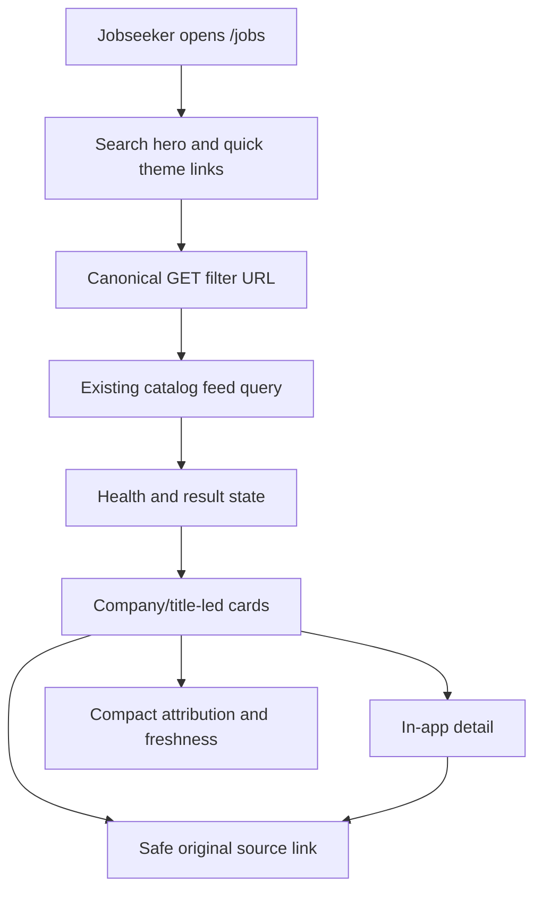
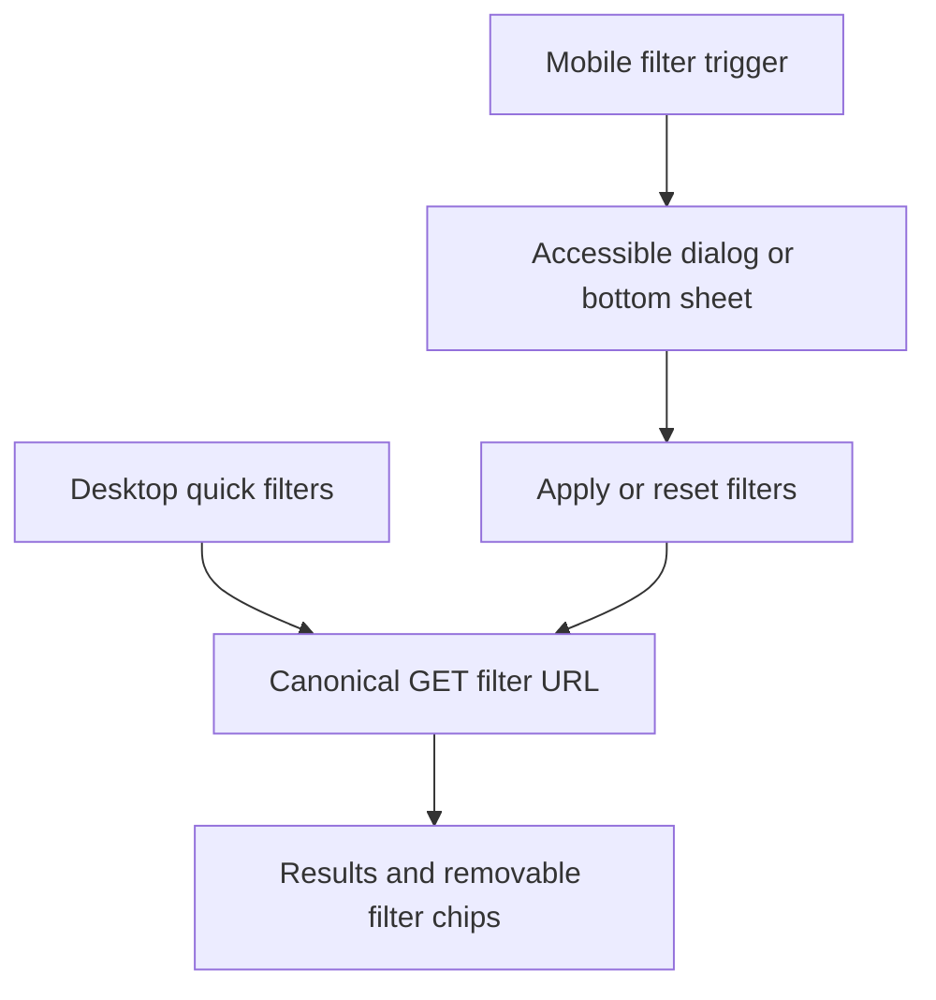

# Jobseeker Portal Discovery - Plan

## Goal Capsule

Reframe the authenticated job catalog as a fast, trustworthy jobseeker portal: search and browse jobs by company, title, and role; scan visually rich cards; open the original posting as the primary action; and use fast mobile filters.

The UI must remove direct job registration and personal saved/excluded/application/memo controls from the current jobseeker journey without deleting their data model, APIs, backups, or legacy-compatible routes.

Stop if the redesign would hide required source attribution, make an unapproved provider appear active, or alter catalog visibility through retained personal-state filters.

---

## Product Contract

### Summary

This plan turns `/jobs` into a familiar-but-distinct Korean job portal experience with a search-led theme area, compact result cards, and mobile-first filtering.

It preserves provider attribution, original links, freshness, lifecycle, and health status while keeping non-portal personal-management features out of the jobseeker-facing surface.

### Problem Frame

The current automatic catalog is technically complete but feels like an internal dashboard: every filter is expanded, cards expose provenance and personal-management actions with equal weight, and navigation promotes direct registration.

A job seeker needs to recognize a company and opening quickly, search a known target, browse recent role-relevant openings, and confidently reach the original source without confusing personal tracking or operator tools.

### Requirements

**Portal discovery**

- R1. `/jobs` presents a company/title/role search-led discovery screen with newest-job browsing and URL-backed catalog filters.
- R2. Cards make company name and job title the primary scan targets, show a neutral visual identifier instead of an unlicensed company logo, and keep deadline plus essential job metadata immediately scannable.
- R3. The original posting is the strongest detail and card-level external action; provider attribution, source freshness, lifecycle, and safe external-link behavior remain visible as secondary trust information, including a contextual accessible name, new-tab notice, `noopener noreferrer`, and no-referrer policy.
- R4. A theme area offers data-derived role, location, or deadline journeys from the currently returned verified results plus clearly editorial curated themes when configured; sparse, preparing, degraded, or failed feeds never invent a data claim or popularity count.

**Focused jobseeker surface**

- R5. The automatic-catalog discovery and detail surfaces do not render saved/excluded, application status, memo, next-action, personal duplicate-decision, or personal report controls.
- R6. The primary navigation does not advertise direct job registration or operator settings; retained legacy data and read routes remain compatible, while ordinary jobseeker sessions cannot create new manual postings.
- R7. Personal-state query flags do not change automatic-catalog discovery visibility in the redesigned UI, even when old state records exist, and canonical UI URLs omit those flags.

**Responsive and accessible interaction**

- R8. Desktop keeps fast search and quick filters near results; smaller screens use an accessible filter dialog or bottom sheet with apply, reset, escape/close, focus restoration, 44px targets, and one non-duplicated live summary of the new result or feed state.
- R9. Filter submission, removal, reset, pagination, detail return links, and card focus continue to use safe canonical GET URLs.

### Scope Boundaries

**In scope**

- Jobseeker-focused information architecture and responsive visual treatment for automatic `/jobs` and automatic job detail.
- Hiding direct registration, operator settings, personal tracking, and personal duplicate controls from the primary catalog journey.
- Data-derived and static curated theme links that map only to already supported catalog filters.

**Out of scope**

- Activating or scraping any provider, using a provider/company logo without permission, or altering source approval requirements.
- Deleting personal-state, duplicate, manual-job, or backup data; redesigning operator administration; or making catalog browsing anonymous.
- Changing the collection pipeline, catalog schema, provider attribution contract, or application submission behavior.

#### Deferred to Follow-Up Work

- Operator-specific settings information architecture and a deliberate retirement policy for legacy manual-job routes.
- Licensed company logos or other source-provided artwork after provider terms explicitly permit it.
- Personal tracking as a separate, explicitly chosen jobseeker product area if it becomes a validated need.

---

## Planning Contract

### Key Technical Decisions

- KTD1. **Keep catalog data and legacy routes, remove their primary UI entry points.** (session-settled: user-directed — chosen over retaining personal controls in the job list: the target is a job seeker searching postings, not a business user or personal tracker.) UI components stop rendering the controls and discovery ignores their query flags; no destructive data or migration work belongs in this redesign. Governs R5, R6, R7.
- KTD2. **Use a search-first quick-scan layout rather than a workspace or editorial home.** (session-settled: user-directed — chosen over dense filter workspace and summary-first feed: the user wants to locate a desired company or role and browse recent openings quickly.) The server-rendered GET feed remains the source of truth. Governs R1, R2, R9.
- KTD3. **Use a portal-inspired but original visual language.** (session-settled: user-directed — chosen over copying Saramin, JobKorea, or Albamon visuals: their familiar interaction model is useful, but third-party brands and layouts are not reusable.) Neutral monograms and CSS treatments replace assumed logos. Governs R2, R4.
- KTD4. **Treat original links and attribution as trust infrastructure.** (session-settled: user-directed — chosen over hiding source detail for a cleaner card: the original posting is the strongest next action, while provider attribution and freshness establish trust.) The main CTA opens the safe original URL; attribution stays adjacent but secondary. Governs R3.
- KTD5. **Generate themes from safe feed dimensions with a small editorial overlay.** (session-settled: user-directed — chosen over purely automatic or purely curated themes: automatic themes follow current catalog data while occasional editorial themes improve entry points.) Themes must degrade gracefully when feed data is sparse or unhealthy. Governs R4.

### High-Level Technical Design

### Assumptions

- Authentication remains required for this UX pass because anonymous catalog policy is a separate auth and privacy decision.
- Curated themes will be a local, reviewable configuration rather than an operator-managed CMS surface.
- Provider/source names and safely returned attribution fields are acceptable display data; source raw payloads and non-approved assets are not.

### System-Wide Impact

Job seekers receive a simpler catalog surface while existing personal-state, duplicate, manual-job, and operator functions remain stored and route-compatible behind the redesigned primary navigation.

Source compliance is unchanged: approved-provider gates, HTTPS URL validation, required attribution, current feed health semantics, and lifecycle messaging still govern what can be shown.

### Risks and Dependencies

- Hidden controls alone are insufficient because current feed queries can let saved/excluded state change which jobs appear; the discovery projection must ignore those flags while retaining internal compatibility.
- Existing E2E scenarios exercise personal tracking and manual registration. Replace user-facing expectations carefully without weakening their retained data-layer or legacy-route coverage.
- Theme links must be based on supported normalized filters and must not imply inventory or provider coverage when a feed is sparse, preparing, degraded, or failed.

---

## Implementation Units

### U1. Define a jobseeker discovery projection

- **Goal:** Keep automatic catalog results stable and public-discovery-oriented regardless of retained personal saved/excluded state.
- **Requirements:** R1, R5, R7, R9; KTD1 and KTD2.
- **Dependencies:** None.
- **Files:** `app/(dashboard)/jobs/queries.ts`, `lib/validation/feed.ts`, `components/filters.tsx`, `tests/unit/feed-query.test.ts`, `tests/unit/feed-filter-chips.test.ts`, `tests/e2e/application-tracking.spec.ts`.
- **Approach:**
  1. Separate user-visible discovery filters from retained personal-state compatibility fields without deleting the underlying schema or personal actions.
  2. Ensure the automatic feed ignores `saved` and `includeExcluded` visibility changes, including the E2E fixture path.
  3. Remove personal filter controls and chips while keeping public search, region, role, career, employment, deadline, source, sort, pagination, and canonical URL behavior; strip retained personal flags from links rendered by the new surface.
- **Patterns to follow:** Existing `parseFeedQuery`, strict feed response schemas, and URL-derived `moreHref`/`currentListPath` behavior.
- **Test scenarios:**
  - A known company/title search and all public filters retain their normalized GET URL after reload.
  - Old `saved` or `includeExcluded` query parameters cannot hide or isolate catalog postings.
  - A retained excluded or saved personal-state fixture does not alter total, pagination, or visible automatic cards.
  - A test-only authenticated personal-state fixture seam in `lib/e2e/personal-state.ts` seeds retained state without restoring a user-facing control.
  - Removing a visible applied filter resets `take` while retaining the other public filters.
- **Verification:** Automatic discovery gives the same catalog visibility for equivalent public filters regardless of a user’s stored personal state.

### U2. Build the portal discovery header, theme entry points, and responsive filters

- **Goal:** Replace the expanded dashboard filter grid with a search-led portal entry that supports fast desktop scan and accessible mobile filtering.
- **Requirements:** R1, R4, R8, R9; KTD2, KTD3, and KTD5.
- **Dependencies:** U1.
- **Files:** `app/(dashboard)/jobs/page.tsx`, `components/filters.tsx`, `components/feed-status.tsx`, `app/globals.css`, `tests/e2e/job-discovery.spec.ts`, `tests/e2e/accessibility.spec.ts`.
- **Approach:**
  1. Render a portal hero with one prominent company/title/role search entry and supported quick-filter links.
  2. Derive visible themes only from normalized values in the current verified result set, merge a small clearly editorial theme configuration, and show no popularity/count claim; hide data-derived themes when health or data cannot support them.
  3. Keep a compact desktop filter affordance; use a semantic dialog or bottom-sheet interaction on mobile for the complete public filter set.
  4. Preserve health, preparing, empty, degraded, and failed states near the results without presenting them as normal empty inventory.
- **Patterns to follow:** Existing server-rendered `/jobs` GET model, `FeedStatus`, 44px target and focus-visible rules in `app/globals.css`, and the browser-context E2E setup rule in `docs/engineering/lessons-learned.md`.
- **Test scenarios:**
  - Default `/jobs` shows search, a truthful result count, quick themes drawn from visible results, and newest result cards.
  - A theme link produces only supported URL filters and returns the matching catalog state.
  - On a 375px viewport, filter trigger opens a labelled modal/sheet; Escape/close returns focus; apply and reset update the URL and results.
  - Preparing, degraded, failed, and sparse fixtures do not render fabricated theme counts or a misleading true-zero state.
  - Keyboard and axe checks cover filter trigger, dialog controls, chips, visible focus, and a single live result/feed-state announcement after search, apply, or reset.
- **Verification:** A job seeker can search, browse a theme, refine filters on mobile, and understand feed availability without seeing internal dashboard density.

### U3. Redesign cards and detail around the original posting

- **Goal:** Make company/title recognition and the original source action dominant while preserving accurate source trust information.
- **Requirements:** R2, R3, R5, R9; KTD1, KTD3, and KTD4.
- **Dependencies:** U1, U2.
- **Files:** `components/job-list.tsx`, `app/(dashboard)/jobs/[id]/page.tsx`, `components/provider-attribution.tsx`, `app/globals.css`, `tests/e2e/job-discovery.spec.ts`, `tests/e2e/automatic-discovery.spec.ts`, `tests/e2e/provider-attribution.spec.ts`.
- **Approach:**
  1. Build a compact card hierarchy: neutral company identifier, company, title, key role/location/employment/deadline facts, then a compact source/freshness block.
  2. Keep title navigation in-app and make the safe original source link the primary external CTA with contextual accessible text, new-tab notice, `noopener noreferrer`, and no-referrer semantics.
  3. Remove personal list/detail controls and reduce duplicate evidence to non-primary context without changing underlying duplicate data.
  4. Keep lifecycle, missing/disabled source behavior, attribution copy, and return-to-card focus semantics intact.
- **Patterns to follow:** `ProviderAttribution` safe-link/required-label rules, `FocusAnchor`, `safeReturnTo`, and existing lifecycle labels.
- **Test scenarios:**
  - Each automatic card has company/title-first reading order, neutral visual fallback, and a contextual original-link name that identifies its job and new-tab behavior.
  - Detail promotes the original link and retains provider attribution, observed time, lifecycle, and safe back navigation.
  - Automatic list and detail expose no save, exclude, application-status, memo, or personal duplicate controls.
  - Malformed, unsafe, or sensitive-query source URLs are rejected before rendering; approved Saramin attribution still satisfies its label contract.
  - Return from detail restores the original card hash and keyboard focus.
- **Verification:** A user can identify an opening, trust its source, and leave for the original posting without encountering personal-tracker UI.

### U4. Simplify jobseeker navigation and preserve compatibility coverage

- **Goal:** Remove business/operator-oriented routes from primary jobseeker navigation while leaving retained routes and data safe.
- **Requirements:** R5, R6; KTD1.
- **Dependencies:** U1, U3.
- **Files:** `components/app-shell.tsx`, `app/(dashboard)/jobs/new/page.tsx`, `app/(dashboard)/jobs/actions.ts`, `tests/e2e/job-registration.spec.ts`, `tests/e2e/application-tracking.spec.ts`, `tests/e2e/accessibility.spec.ts`, `README.md`.
- **Approach:**
  1. Keep brand and catalog discovery as the primary navigation destination; remove direct registration and settings links from the jobseeker menu.
  2. Retain stored manual-job data and read compatibility, but make `/jobs/new` a non-mutating legacy notice or redirect for ordinary jobseeker sessions and reject its create action outside an explicit future operator policy.
  3. Reframe former personal-tracking browser tests as retained behavior/data compatibility tests plus explicit absence checks for the new surface.
- **Patterns to follow:** Existing authenticated app shell, legacy fallback routes, and role/accessible-name navigation tests.
- **Test scenarios:**
  - Primary navigation has no direct registration or operator-settings link and remains keyboard accessible at desktop and mobile widths.
  - Direct `/jobs/new` requests cannot create a manual posting for a standard jobseeker session and offer a safe catalog return path.
  - Existing personal-state mutations can remain data-compatible, but `/jobs` and automatic detail no longer expose their controls.
- **Verification:** The visible product consistently targets job seekers while retained non-portal capabilities do not regress or leak into discovery.

### U5. Validate the visual system and production-safe states

- **Goal:** Confirm the redesign remains responsive, accessible, performant, and compliant with source/health boundaries.
- **Requirements:** R2, R3, R4, R8, R9.
- **Dependencies:** U2, U3, U4.
- **Files:** `tests/e2e/job-discovery.spec.ts`, `tests/e2e/automatic-discovery.spec.ts`, `tests/e2e/provider-attribution.spec.ts`, `tests/e2e/accessibility.spec.ts`, `tests/e2e/performance.spec.ts`.
- **Approach:**
  1. Update discovery contracts to assert portal hierarchy rather than the previous dashboard layout.
  2. Preserve blocked-external-network performance testing and production E2E-bypass denial.
  3. Exercise all feed health states and source-attribution boundaries after the visual reorganization.
- **Patterns to follow:** Existing fixture scenarios, local-origin route blocking, `page.context().request` setup, and performance warm-up/p95 checks.
- **Test scenarios:**
  - Browser tests cover desktop and mobile scan, search, quick themes, filters, pagination, detail return, original links, and absence of personal controls.
  - Health/error/source attribution fixtures retain their truthful state, reject unsafe or sensitive-query URLs, and never expose provider secrets.
  - A 1,000-row fixture preserves the existing interaction performance threshold without external network traffic.
- **Verification:** The full automated suite validates the redesigned jobseeker flow alongside existing catalog safety contracts.

---

## Verification Contract

| Scope | Evidence |
| --- | --- |
| Query and component behavior | Targeted Vitest suites for feed query/chips and new portal helpers |
| Type and lint integrity | `npm run lint` and `npm run typecheck` |
| Portal browser journeys | Updated `tests/e2e/job-discovery.spec.ts`, `tests/e2e/automatic-discovery.spec.ts`, `tests/e2e/provider-attribution.spec.ts`, and accessibility coverage |
| Performance and safety | Existing `tests/e2e/performance.spec.ts` with local-only network policy |
| Release confidence | `npm run verify`; run the complete browser suite before the UI checkpoint is pushed |

---

## Definition of Done

- `/jobs` behaves like a company/title-led jobseeker discovery portal on desktop and mobile.
- Users can search and browse supported themes, refine public filters, paginate, open detail, and follow the original posting through canonical URLs.
- Automatic cards and detail retain source attribution, freshness, lifecycle, health, and safe-link behavior without displaying personal-management or direct-registration UI.
- Existing personal/legacy data stays intact and no longer affects automatic discovery visibility through the redesigned surface.
- Accessibility, provider-attribution, performance, unit, lint, type, build, and relevant browser contracts pass.
- The implementation is committed and pushed as task-owned, reviewable checkpoints under the repository Git conventions.
